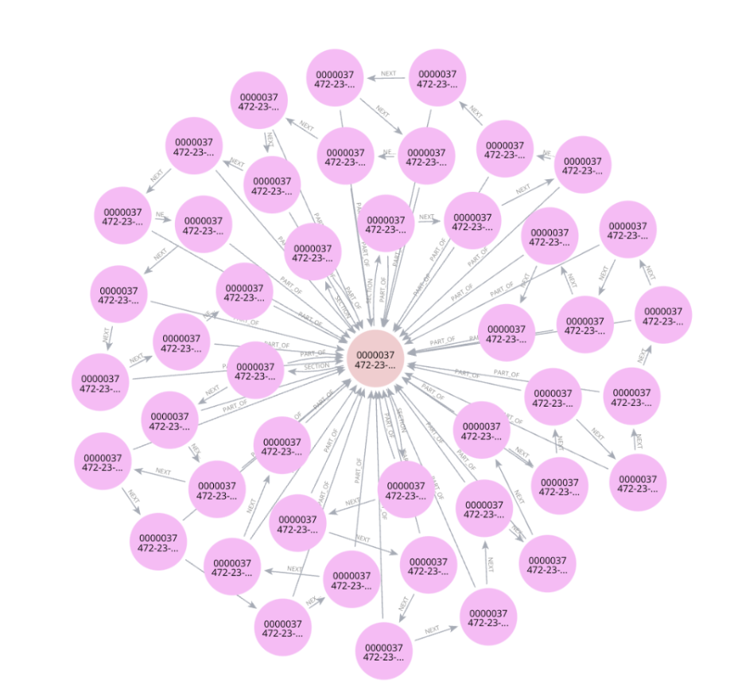

# Exploring the Enhancement of Financial Report Retrieval with KG RAG
## Background
This research utilizes Knowledge Graph-enhanced Retrieval-Augmented Generation (KG RAG) technology aimed at enhancing the question-answering capabilities of financial document models. By comparing KG RAG with baseline RAG models, the study critically evaluates and seeks to improve the performance of these systems in terms of information retrieval accuracy.

## Goal
The goal of this project is to integrate Knowledge Graph-enhanced RAG technology to enhance the retrieval efficiency of RAG systems in financial analysis, addressing the limitations of traditional RAG models when handling complex financial documents.

## Research Objective
The research objective is to demonstrate the effectiveness of Knowledge Graph-enhanced RAG (Retrieval-Augmented Generation) using the SEC’s 10-K dataset. This involves assessing enhancements in managing complex financial terminologies and document structures by comparing it to baseline RAG models.

## Data Source
The data sources for this project include Form 10-K reports from major technology companies like Apple and Amazon, which are annually disclosed by the U.S. Securities and Exchange Commission (SEC). These documents were chosen for their complexity and volume, making them suitable benchmarks for evaluating the RAG system's capabilities.

## Methodology
The baseline RAG uses the LlamaIndex framework and the GPT-3.5 Turbo language model to process financial statements in JSON format. In contrast, the KG RAG system combines the LangChain framework, OpenAI API, and Neo4j graph database to enhance data retrieval relevance and accuracy through entity recognition and relationship extraction.

## Our RAG system on colab
| Colab | Info |
| --- | --- |
 | Graph RAG
 | Baseline RAG
